# 1. Relatório sobre Métricas em .NET - Criar uma métrica personalizada

Esse relatório é sobre a implementação contida na pasta `Metrics` na raiz do projeto.

## Introdução

Este relatório aborda a utilização de métricas em aplicações .NET, com foco em métricas personalizadas. As métricas são essenciais para monitorar o desempenho e comportamento de sistemas, permitindo identificar problemas e otimizar a performance. No contexto do .NET, as APIs System.Diagnostics.Metrics são utilizadas para este fim.

## Tecnologias Utilizadas

- **SDK do .NET Core 6 ou superior**: Utilizado para desenvolver aplicações .NET que neste caso utilizam as APIs de métricas.
- **Pacote NuGet System.Diagnostics.DiagnosticSource**: Necessário para adicionar suporte às APIs de métricas no projeto.
- **dotnet-counters**: Ferramenta de linha de comando utilizada para monitorar e exibir métricas de aplicações .NET em execução.

## Conceitos Aprendidos

### **1. Métricas Personalizadas**

- As métricas personalizadas são importantes para monitorar aspectos específicos de uma aplicação que não são cobertos pelas métricas padrão do .NET. Para criar uma métrica personalizada, é necessário criar um novo Medidor (Meter) e um instrumento (Counter).

### **2. Sistema de Medição**

- O Medidor é o ponto de entrada para criar um grupo nomeado de instrumentos. Ele define o escopo das métricas que serão coletadas. Os instrumentos são responsáveis por registrar as medidas numéricas necessárias para calcular as métricas. Por exemplo, um instrumento do tipo Counter registra contagens de eventos (Neste caso a venda de chapéu por segundo).

### **3. Criação e Registro de Métricas:**
- A criação de um Medidor e de um instrumento é feita através da classe Meter e de métodos como CreateCounter. O registro de medidas é feito através do método Add do instrumento. Isso permite que as métricas sejam atualizadas conforme a aplicação é executada.

### **4. Visualização de Métricas**

A ferramenta dotnet-counters pode ser utilizada para monitorar e exibir métricas de uma aplicação .NET em execução. É possível especificar os contadores que deseja monitorar, bem como pausar e retomar a coleta de métricas conforme necessário.

## Passo a Passo

Passo a passo para criar e registrar métricas personalizadas em uma aplicação .NET. Para seguir este tutorial, é necessário ter o SDK do .NET Core 6 ou superior instalado.

### 1. Criar um novo projeto de console

Crie um novo projeto de console utilizando o comando `dotnet new console` em um terminal:

```bash
dotnet new console -n Metrics
```

Neste caso foi criado utilizando o Rider:

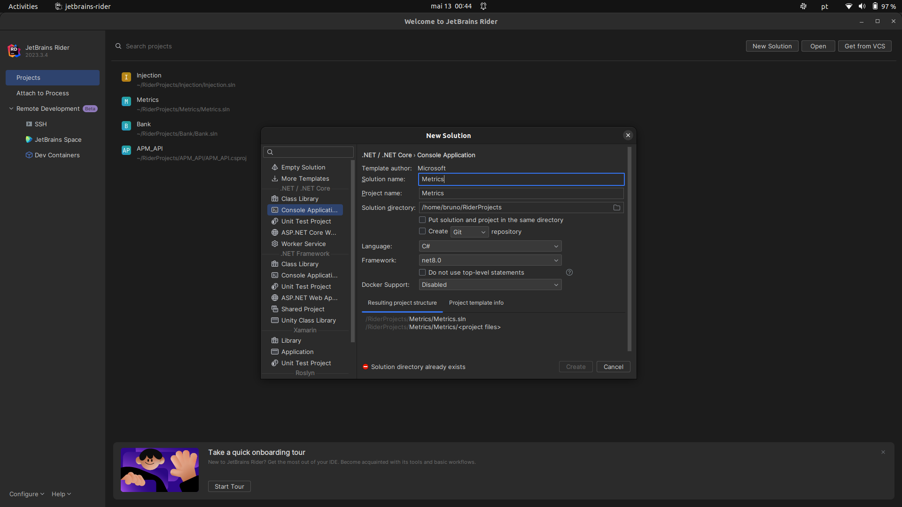

### 2. Adicionar o pacote System Diagnostics DiagnosticSource

Adicione o pacote NuGet `System.Diagnostics.DiagnosticSource` ao seu projeto para ter acesso às APIs de métricas:

```bash
dotnet add package System.Diagnostics.DiagnosticSource --version 9.0.0
```

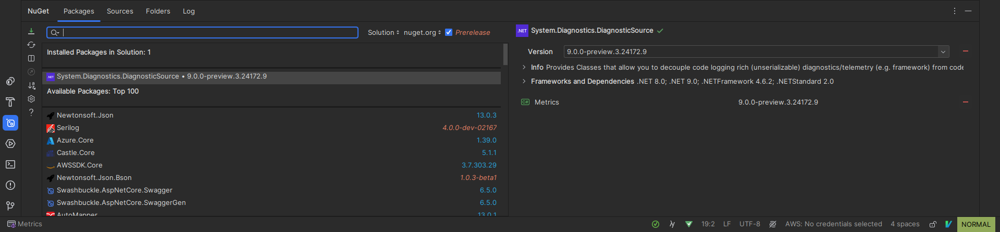

### 3. Adicionar código no Program.cs

Substitua o conteúdo do arquivo `Program.cs` com o seguinte código:

```csharp
using System;
using System.Diagnostics.Metrics;
using System.Threading;

class Program
{
    static Meter s_meter = new Meter("HatCo.Store");
    static Counter<int> s_hatsSold = s_meter.CreateCounter<int>("hatco.store.hats_sold");

    static void Main(string[] args)
    {
        Console.WriteLine("Press any key to exit");
        while(!Console.KeyAvailable)
        {
            // Como se nossa loja vendesse 4 chapéus por segundo
            Thread.Sleep(1000);
            s_hatsSold.Add(4);
        }
    }
}
```

Este código cria um Medidor (`Meter`) chamado `HatCo.Store` e um contador (`Counter<int>`) chamado `hatco.store.hats_sold`, que é usado para registrar a quantidade de chapéus vendidos.

### 4. Executar a aplicação

Execute a aplicação utilizando o comando `dotnet run` em um terminal. A aplicação irá simular vendas de chapéus a cada segundo.

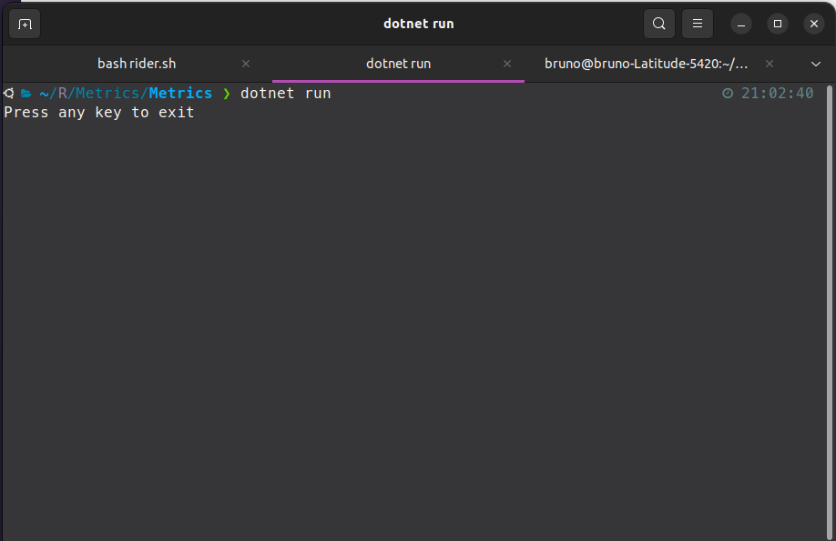

### 5. Monitorar as métricas

Enquanto a aplicação estiver em execução, abra outro terminal e utilize o comando `dotnet-counters` para monitorar as métricas:

```bash
dotnet-counters monitor -n Metrics --counters HatCo.Store
```

Conseguimos ver as métricas sendo exibidas, mostrando a quantidade de chapéus vendidos a cada segundo.

- 1 segundo

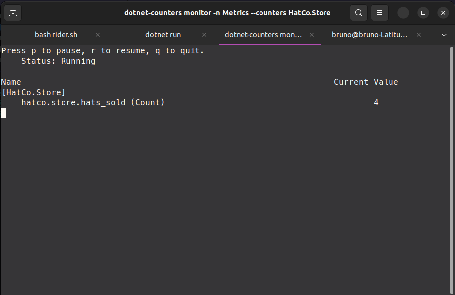

- 2 segundos

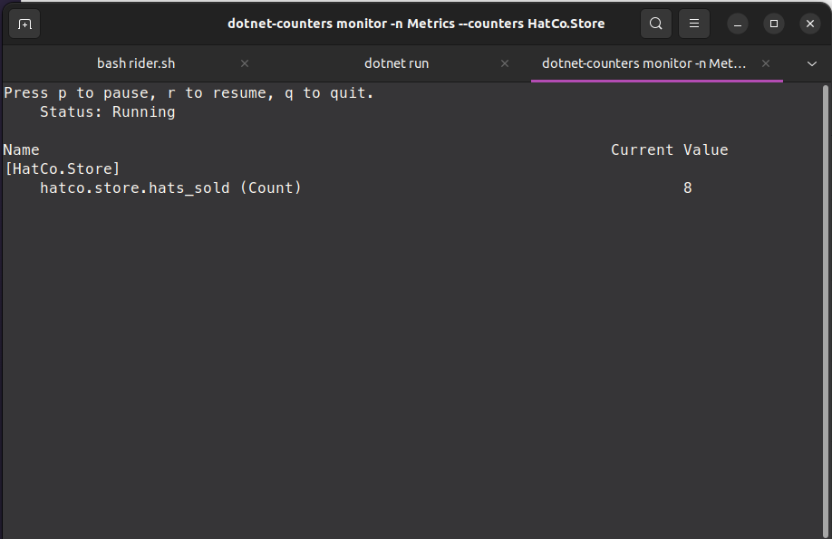

- 3 segundos

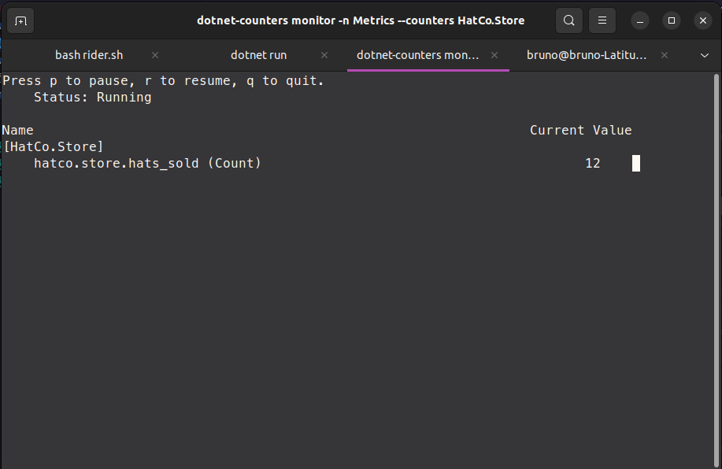

- 4 segundos


## Conclusão

As métricas são fundamentais para monitorar o desempenho e comportamento de aplicações .NET, permitindo identificar problemas e otimizar a performance. A utilização das APIs System.Diagnostics.Metrics e da ferramenta dotnet-counters facilita a criação, registro e visualização de métricas personalizadas, contribuindo para uma melhor compreensão e análise do sistema em execução.


# 2. Relatório sobre Métricas em .NET - Medidor por meio da injeção de dependência

Esse relatório é sobre a implementação contida na pasta `Injection` na raiz do projeto.

## Introdução

Este segundo relatório aborda a implementação de métricas personalizadas em aplicações .NET, utilizando as APIs `System.Diagnostics.Metrics`. Mas diferente do primeiro esse é focando na coleta através da Injeção de Dependência (DI).


## Tecnologias Utilizadas

- **.NET Core 6 e posteriores**: As métricas personalizadas são implementadas utilizando as APIs disponíveis a partir desta versão do .NET Core.
- **ASP.NET Core**: Exemplifica-se a integração das métricas personalizadas em um aplicativo ASP.NET Core, demonstrando a aplicabilidade em cenários web.
- **Injeção de Dependência (DI)**: Utiliza-se a injeção de dependência para obter e gerenciar os medidores de métricas, garantindo uma abordagem mais modular e testável.

## Conceitos Aprendidos

### 1. Métricas Personalizadas: 
- Compreende-se a importância de criar métricas específicas para os requisitos de monitoramento de uma aplicação, além das métricas padrão fornecidas pelo .NET.

### 2. IMeterFactory: 
- Entender o papel da `IMeterFactory` na obtenção dos medidores de métricas, especialmente em cenários que envolvem a injeção de dependência.

### 3. Integração com DI: 
- Integração a criação e o uso de medidores de métricas personalizadas em um ambiente que utiliza injeção de dependência, como ASP.NET Core, garantindo a modularidade e a testabilidade do código.

## Passo a Passo: Implementando Métricas Personalizadas em Aplicações .NET

### 1. Criar um novo projeto de Web Api

Crie um novo projeto de console utilizando o seguinte template:

Neste caso foi criado utilizando o Rider:

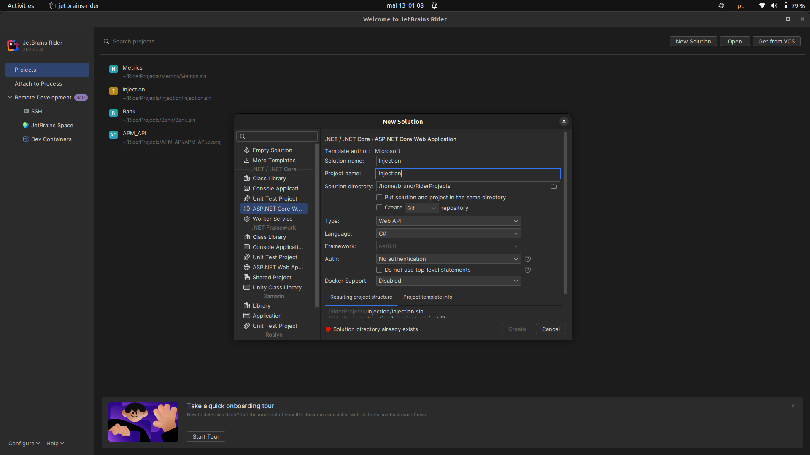

### 2. Adicionar o pacote System Diagnostics DiagnosticSource

Adicione o pacote NuGet `System.Diagnostics.DiagnosticSource` ao seu projeto para ter acesso às APIs de métricas:

```bash
dotnet add package System.Diagnostics.DiagnosticSource --version 9.0.0
```

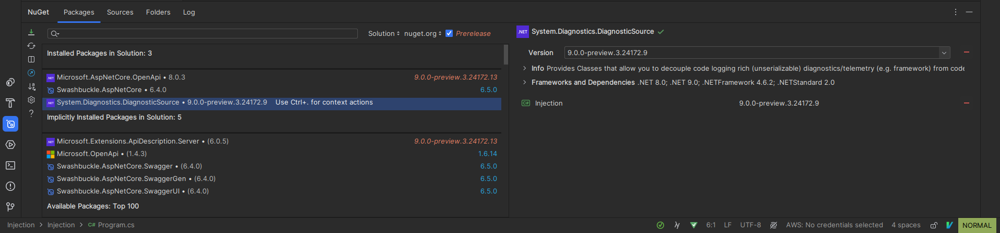

### 3. Implementação da Classe de Métricas Personalizadas

Em um arquivo com o nome de `HatCoMetrics` implemente a seguinte métrica personalizada:

```csharp
using System.Diagnostics.Metrics;

namespace Injection;

public class HatCoMetrics
{
    private readonly Counter<int> _hatsSold;

    public HatCoMetrics(IMeterFactory meterFactory)
    {
        var meter = meterFactory.Create("HatCo.Store");
        _hatsSold = meter.CreateCounter<int>("hatco.store.hats_sold");
    }

    public void HatsSold(int quantity)
    {
        _hatsSold.Add(quantity);
    }
}
```

### 4. Registro da Classe de Métricas no Contêiner de DI

```csharp
    using Microsoft.AspNetCore.Mvc;

    using Injection;

    var builder = WebApplication.CreateBuilder(args);
    builder.Services.AddSingleton<HatCoMetrics>();
```

### 5. Utilização das Métricas no Código

```csharp
    app.MapPost("/complete-sale", ([FromBody] SaleModel model, HatCoMetrics metrics) =>
    {
        metrics.HatsSold(model.QuantitySold);
    }).WithName("CompleteSale")
    .WithOpenApi();;

    public class SaleModel
    {
        public int QuantitySold { get; set; }
    }
```

### 6. Teste e Validação - Monitorar as métricas

Teste do funcionamento das métricas personalizadas e validação se estão capturando os dados corretamente. Certifique-se de que as métricas estão sendo registradas conforme o esperado e de que estão disponíveis para análise.

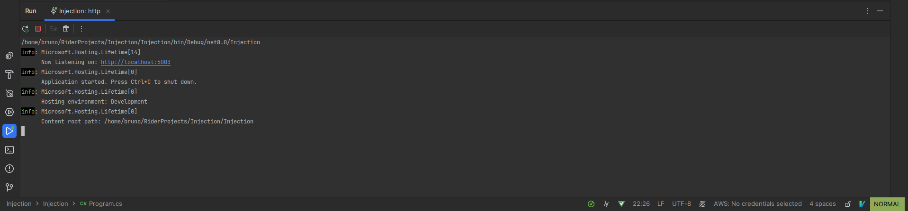

Enquanto a aplicação estiver em execução, abra outro terminal e utilize o comando `dotnet-counters` para monitorar as métricas:

```bash
dotnet-counters monitor -n Injection --counters HatCo.Store
```

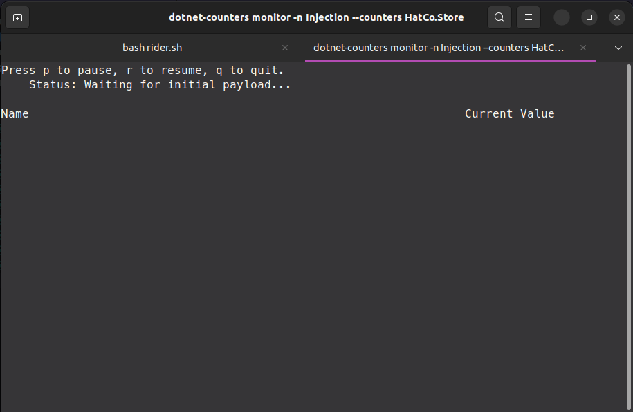

Ao rodar a aplicação, teremos acesso ao Swagger com a Rota que criamos:

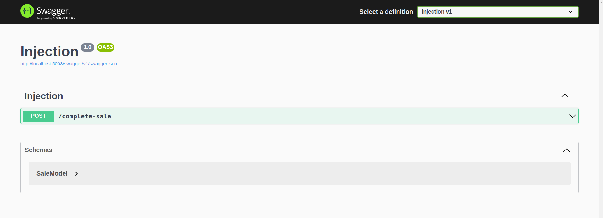

Agora quando utilizamos da rota para adicionar QuantitySold de chapéu, conseguimos monitorar esse número aumentando.

- ### 1. Primeira Interação

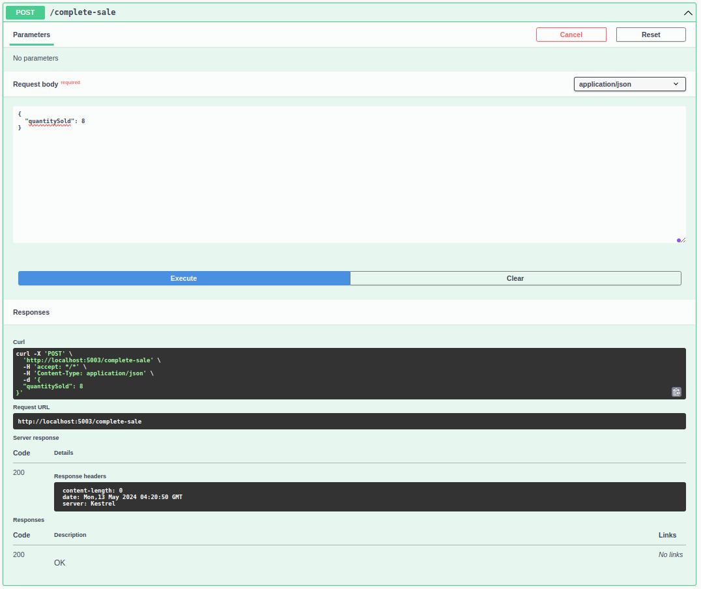

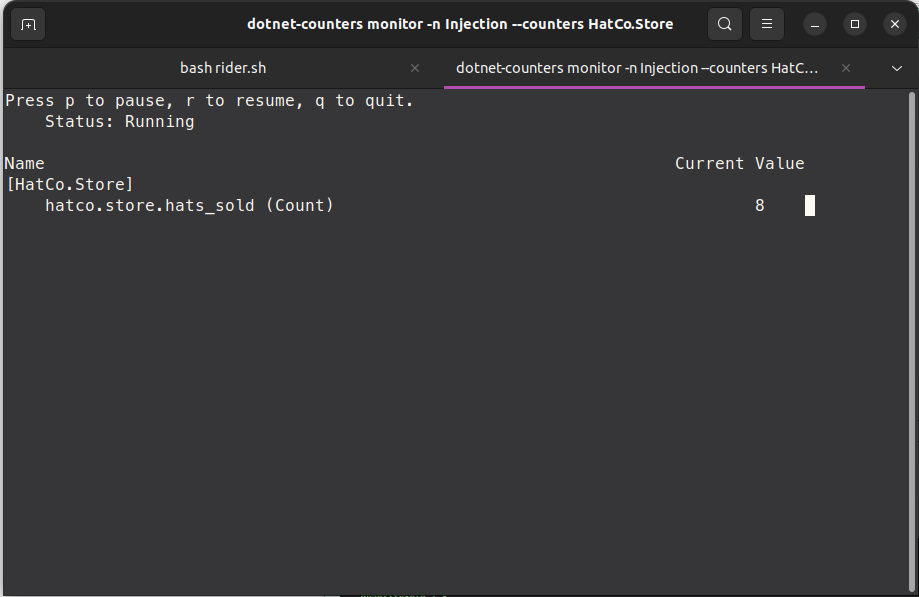

- ### 2. Segunda Interação

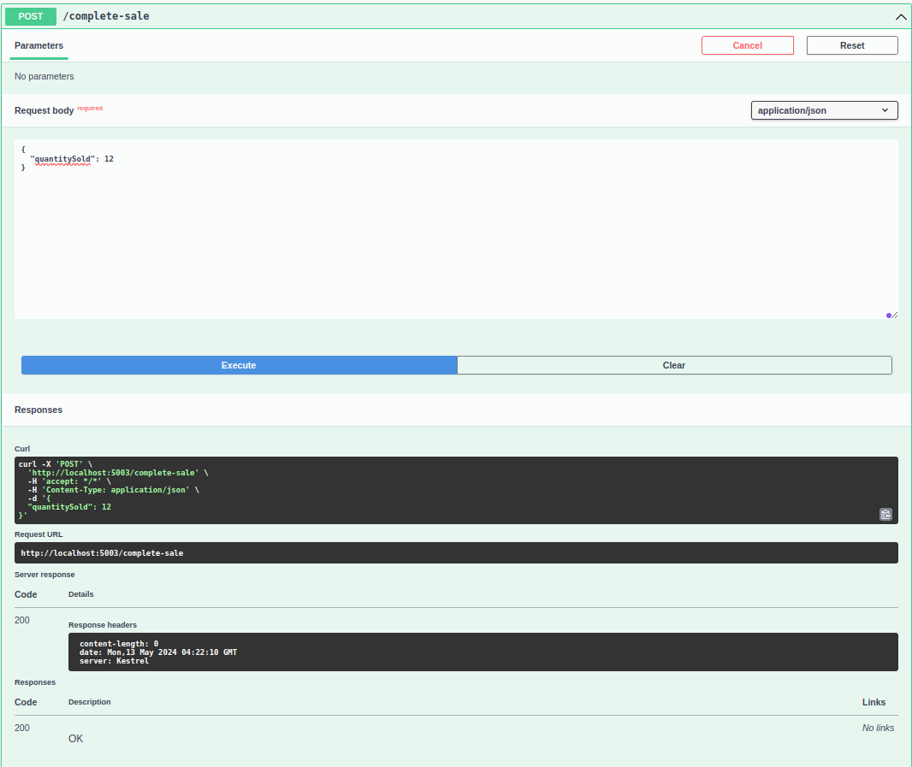

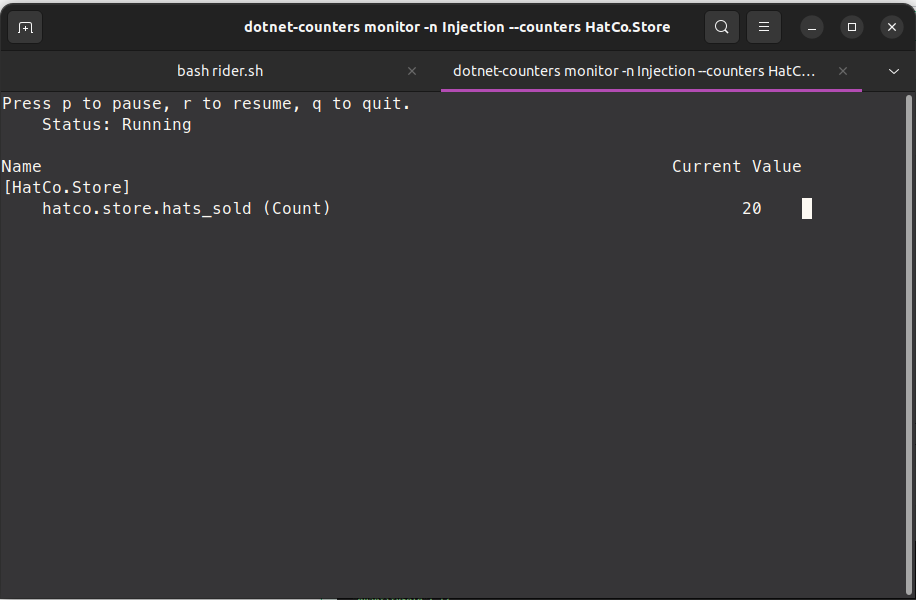

## Conclusão

Injeção de dependência é uma abordagem prática e eficaz para a implementação de métricas personalizadas em aplicações .NET, destacando a importância de monitorar aspectos específicos do sistema além das métricas padrão. A utilização da injeção de dependência facilita a integração dos medidores de métricas no código, promovendo a modularidade e a testabilidade.